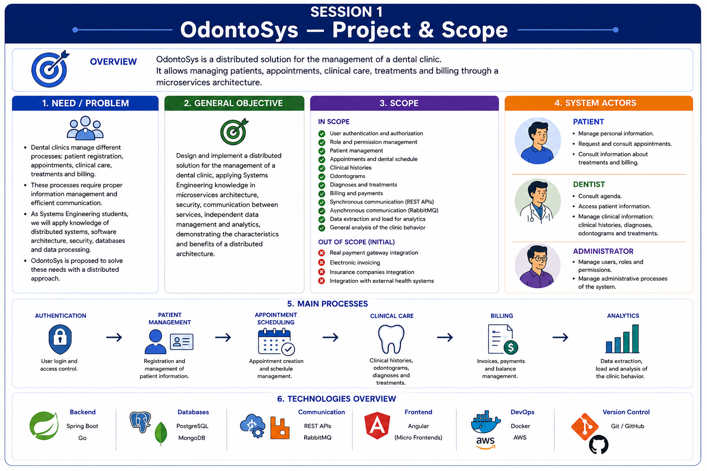
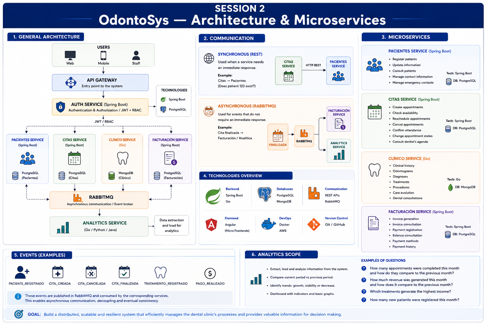

# Weekly Status - Week 01

* FULL_NAME: Juan Diego Mora Alvarado 
* GITHUB_USER: juan0898
* TEAM: OdontoSys
* SPRINT_GOAL: Define the initial scope, responsibilities, architecture, technologies, and integration requirements of the Billing microservice within the OdontoSys distributed system.

## 1. User stories worked this week

| HU ID      | Title                                              | Status (todo/doing/done) | Evidence (PR or commit URL) |
| ---------- | -------------------------------------------------- | ------------------------ | --------------------------- |
| HU-BIL-001 | Define Billing microservice scope and architecture | done                     | Evidence images             |

## 2. My individual contribution

* Reviewed the general architecture and scope of the OdontoSys distributed system.
* Defined the initial scope and responsibilities of the Billing microservice.
* Identified Billing as one of the main business microservices of the OdontoSys architecture.
* Defined Spring Boot as the backend technology for the Billing microservice.
* Defined PostgreSQL as the independent database technology for Billing.
* Identified the main responsibilities of the Billing microservice:

  * Invoice generation.
  * Invoice consultation.
  * Payment registration.
  * Balance consultation.
  * Payment method management.
  * Payment history.
* Established that payment processing will initially be simulated and will not depend on a real payment gateway.
* Reviewed how Billing will participate in the distributed architecture without directly accessing databases owned by other microservices.
* Identified REST APIs as the mechanism for synchronous communication when an immediate response from another service is required.
* Identified RabbitMQ as the mechanism for asynchronous communication and event processing.
* Identified events related to Billing, such as completed appointments and completed payments, that may participate in the distributed workflow.
* Reviewed how Billing information, including invoices and payments, can later be used by the Analytics component.
* Created visual evidence documenting the project scope and the proposed distributed architecture.

## 3. Blockers and risks

* The final Billing data model has not yet been completely defined.
* The API contracts between Billing and the other OdontoSys microservices still need to be specified.
* Billing depends on information generated by other domains, especially patients, appointments, and clinical processes.
* The asynchronous events that Billing will consume or publish through RabbitMQ must be clearly defined.
* Direct access to databases owned by other microservices must be avoided to preserve service independence.
* Business rules for invoice generation, payments, balances, and invoice statuses still need to be refined.
* Real payment gateway integration is outside the initial project scope, so payments will initially be simulated.

## 4. Plan for next week

* Design the initial data model for the Billing microservice.
* Define the main Billing entities and their relationships.
* Define how invoices, invoice details, procedures, payments, payment methods, and invoice statuses will be represented.
* Establish primary and foreign keys required by the relational model.
* Create a visual database diagram for the Billing service.
* Document the Billing data model and its main relationships.
* Continue defining the integration requirements between Billing and the other OdontoSys microservices.
* Review the events that Billing will consume and publish through RabbitMQ.
* Prepare the Billing domain for its future implementation using Spring Boot and PostgreSQL.

## 5. Compliance self-check

* [x] Conventional Commits - `type(scope): summary`
* [ ] Per-environment HU branch + PR to that environment (hu-xxx-dev -> develop, ...)
* [x] Testable acceptance criteria
* [ ] Tests added/updated (unit / integration)
* [x] DDD / hexagonal boundaries respected (domain has no I/O)
* [x] No secrets; config via environment variables

## 6. Evidence links

### Documentación PDR de OdontoSys
- [01 - Proyecto y alcance](./OdontoSys_PDR_5_documentos_actualizados/01_proyecto_y_alcance.md)
- [02 - Arquitectura y microservicios](./OdontoSys_PDR_5_documentos_actualizados/02_arquitectura_y_microservicios.md)
- [03 - Auth y seguridad](./OdontoSys_PDR_5_documentos_actualizados/03_auth_y_seguridad.md)
- [04 - Comunicación y analítica](./OdontoSys_PDR_5_documentos_actualizados/04_comunicacion_y_analitica.md)
- [05 - Desarrollo, frontends y despliegue](./OdontoSys_PDR_5_documentos_actualizados/05_desarrollo_frontends_y_despliegue.md)

### Session 1 - Project & Scope

### Session 2 - Architecture & Microservices

