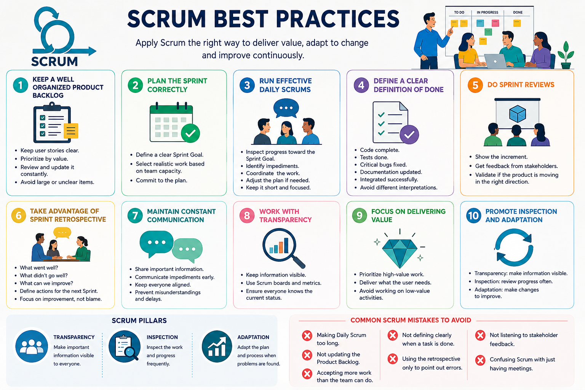
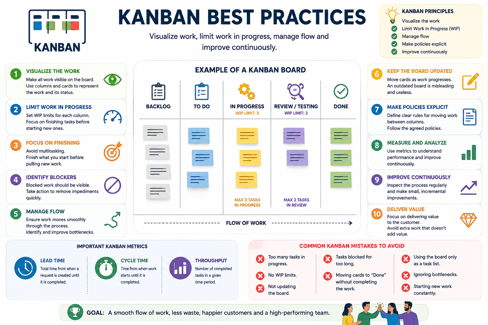

# Weekly Status - Week 02

* FULL_NAME: Juam Diego Mora Alvarado
* GITHUB_USER: juan0898
* TEAM: Di Lucca Dental Care & Technology
* SPRINT_GOAL: Document and apply agile development practices based on Scrum and Kanban to improve work organization, task visibility, team coordination, and continuous improvement throughout the project.

<!-- CONFIG-END -->

## 1. User stories worked this week

| HU ID        | Title                                         | Status (todo/doing/done) | Evidence (PR or commit URL) |
| ------------ | --------------------------------------------- | ------------------------ | --------------------------- |
| HU-AGILE-001 | Scrum and Kanban best practices documentation | done                     | Evidence image              |

## 2. My individual contribution

* Researched and documented the main best practices for applying Scrum within the project.
* Documented the importance of maintaining a clear, prioritized, and constantly updated Product Backlog.
* Defined good practices for Sprint Planning, Daily Scrum, Sprint Review, and Sprint Retrospective.
* Documented the importance of using a clear Definition of Done (DoD) to determine when work can be considered completed.
* Identified transparency, inspection, and adaptation as fundamental principles for continuous improvement.
* Documented common Scrum mistakes that should be avoided during project development.
* Researched and documented Kanban as a method for visualizing and managing the team's workflow.
* Defined a basic Kanban workflow using `Backlog → To Do → In Progress → Review/Testing → Done`.
* Documented the importance of Work In Progress (WIP) limits to prevent excessive simultaneous tasks.
* Identified good practices for detecting blocked tasks and workflow bottlenecks.
* Documented the importance of keeping the Kanban board updated according to the real status of the project.
* Reviewed Kanban metrics such as Lead Time, Cycle Time, and Throughput to support workflow analysis and continuous improvement.
* Created visual evidence of the work completed during the week.

## 3. Blockers and risks

* The Scrum and Kanban practices must be consistently followed by all team members to be effective.
* An outdated Product Backlog or Kanban board could provide an inaccurate representation of the project's actual progress.
* Having too many tasks simultaneously in progress could generate bottlenecks and affect the team's productivity.
* Tasks may be incorrectly considered completed if the Definition of Done is not consistently applied.
* Lack of communication between team members could affect Sprint planning and task coordination.

## 4. Plan for next week

* Apply the documented Scrum and Kanban practices to the project's actual workflow.
* Keep the Product Backlog organized and prioritized according to project needs.
* Identify blocked tasks and possible bottlenecks during development.
* Verify that completed tasks comply with the established Definition of Done.
* Continue documenting the progress and decisions made during the Sprint.
* Apply continuous improvement actions based on the problems identified during the development process.

## 5. Compliance self-check

* [x] Conventional Commits - `type(scope): summary`
* [ ] Per-environment HU branch + PR to that environment (hu-xxx-dev -> develop, ...)
* [x] Testable acceptance criteria
* [ ] Tests added/updated (unit / integration)
* [x] DDD / hexagonal boundaries respected (domain has no I/O)
* [x] No secrets; config via environment variables

## 6. Evidence links

