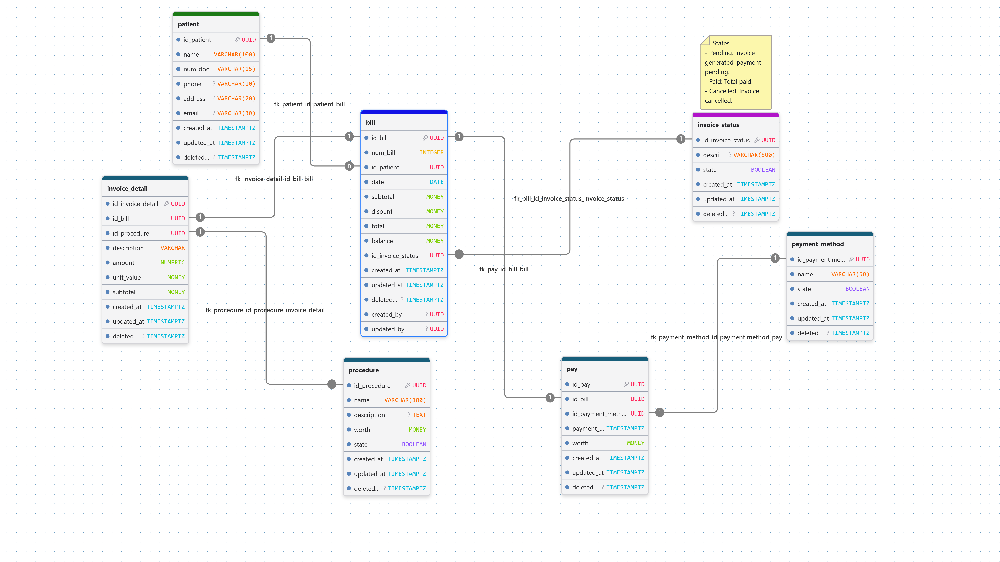

# Modelo de datos — Servicio de Facturación

## Introducción

El presente diagrama representa el **modelo de datos del servicio de facturación**, diseñado para gestionar de manera estructurada la información relacionada con pacientes, facturas, procedimientos, pagos y estados de facturación.

El modelo sigue una estructura relacional en la que cada entidad tiene una responsabilidad específica y se relaciona con otras mediante **claves primarias (UUID)** y **claves foráneas**. Esto permite mantener la integridad de los datos y establecer una trazabilidad clara desde el paciente hasta la factura y los pagos realizados.

La entidad principal del modelo es **`bill`**, que representa la factura asociada a un paciente. Una factura puede contener uno o varios detalles de factura mediante **`invoice_detail`**, donde se registra cada procedimiento realizado, su cantidad, valor unitario y subtotal. Los procedimientos disponibles se encuentran definidos en la entidad **`procedure`**.

El modelo también contempla la gestión del pago mediante las entidades **`pay`** y **`payment_method`**, permitiendo registrar cuánto se ha pagado, mediante qué método y a qué factura corresponde. Adicionalmente, **`invoice_status`** permite controlar el estado de cada factura, por ejemplo: pendiente, pagada o cancelada.

En conjunto, este modelo busca proporcionar una estructura que permita **registrar, consultar y controlar el ciclo de vida de una factura**, manteniendo separadas las responsabilidades de cada entidad y facilitando su implementación dentro de una arquitectura de servicios distribuidos.

link drawbd: https://www.drawdb.app/share/adGdxaZHbCbYPSKwt8CdRAVN
